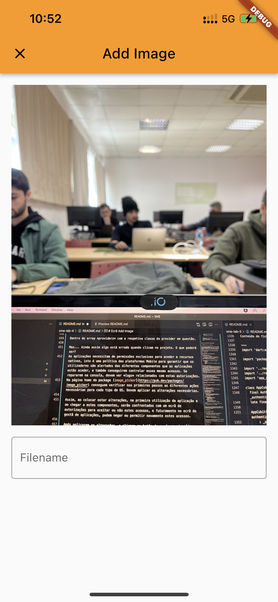

**Universidade Lusófona de Humanidades e Tecnologias**

# Sistemas Móveis Empresariais - Laboratório 4

## Introdução
Neste laboratório iremos desenvolver uma aplicação em Flutter que permite gerir uma galeria de fotografias pessoais com o auxílio da tecnologia Firebase. Tal como no laboratório anterior, iremos utilizar alguns serviços da Firebase como o Firestore, Authentication e um novo Firestorage que nos permite guardar ficheiros multimédia, e é nesse que nos iremos centrar. Estes ficheiro multimédia serão provenientes das fotografias/videos guardados na memória do telémovel e até mesmo provenientes da câmara.

## Gallery app

No final do laboratório é esperado que consigamos visualizar um ecrã de home semelhante ao da figura abaixo:

    
    
    

## Criação do projeto

Começemos pela criação de um projeto em Flutter com o auxílio da CLI.

~~~
flutter create sme_gallery_app
~~~

Em seguida, devem abrir o Android studio na diretoria criada com a instrução acima.

**<u>Nota: Devem criar um novo projeto na firebase e configurá-lo tal como fizeram no [Laboratório 3](https://github.com/ruifgsantos/sme-lab-3)</u>**

## Instalar dependências
Após o processo de configuração da Firebase SDK no novo projeto, necessitamos de software adicional ao disponibilizado pelo SDK fo Flutter que nos permite aceder à galeria pessoal do telémovel e inclusive a câmara.

No contexto do laboratório, apenas vamos precisar de 4 dependências: *firebase_core*, *cloud_firestore*, *firebase_auth* e *firebase_storage*.

Devem executar os seguintes comandos:

~~~
flutter pub add firebase_core firebase_auth cloud_firestore firebase_storage flutter_bloc bloc
flutter pub get
~~~

# Firestorage

*Firestorage* é o serviço da Firebase que se encarrega de gerir ficheiros de diversos tipos. Para usufruir deste serviço, tal como qualquer outro, teremos de o ativar. Acedendo à página home da Firebase Console, no menu lateral, clicamos em *Storage*:

    

Ativamos o serviço com as opções escolhidas por omissão e temos assim o serviço ativo.
Vamos selecionar a tab *rules* na página home do serviço *Storage*, e substituir as regras pelo seguinte conteudo:

~~~
rules_version = '2';
service firebase.storage {
  match /b/{bucket}/o {
    match /{allPaths=**} {
      allow read, write;
    }
  }
}
~~~

Para já, ignoremos a chamada de atenção do Firebase ao dizer que o banco de dados ficará público.

**<u>Devem agora configurar os outros serviços da Firebase tal como fizeram no laboratório anterior.</u>**

# Ecrã Gallery

Este será o ecrã principal da galeria que irá conter todas as nossas fotografias. Para já vamos apenas modificar o ficheiro **main.dart** para conter o seguinte:

~~~
import 'package:firebase_core/firebase_core.dart';
import 'package:flutter/material.dart';

import 'firebase_options.dart';

void main() async {
  WidgetsFlutterBinding.ensureInitialized();
  await Firebase.initializeApp(options: DefaultFirebaseOptions.currentPlatform);
  runApp(const MyApp());
}

class MyApp extends StatelessWidget {
  const MyApp({super.key});

  // This widget is the root of your application.
  @override
  Widget build(BuildContext context) {
    return MaterialApp(
      title: 'Flutter Demo',
      theme: ThemeData(
        primarySwatch: Colors.orange,
      ),
      home: const MyHomePage(title: 'Gallery App'),
    );
  }
}

class MyHomePage extends StatelessWidget {
  const MyHomePage({super.key, required this.title});

  final String title;

  @override
  Widget build(BuildContext context) => Scaffold(
        appBar: AppBar(
          title: Text(title),
        ),
        body: Center(
          child: Column(
            mainAxisAlignment: MainAxisAlignment.center,
            children: const [
              Text(
                'The home screen for the Gallery App',
              ),
            ],
          ),
        ),
        floatingActionButton: FloatingActionButton(
          onPressed: () {},
          child: const Icon(Icons.add),
        ), // This trailing comma makes auto-formatting nicer for build methods.
      );
}
~~~

O ecrã de ome será algo parecido com a seguinte imagem:

    

Para o ecrã ter então as funcionalidade de leitura e inserção de de dados, precisamos dos seguintes componentes:
* A criação de um repository que seja o elo de ligação à Firebase Storage;
* Um ecrã simples que permita a inserção de fotografias, consequentemente, tenha acesso à câmara do telémovel e à galeria de fotografias nativa do telémovel;
* Listagem das fotografias de modo a serem visiveis no ecrã principal;

Começemos então pela criação do ficheiro *firebase_storage_repository.dart* com o seguinte código:

~~~
import 'dart:typed_data';

import 'package:firebase_storage/firebase_storage.dart';
import 'dart:io';

class FirebaseStorageRepository {
  final FirebaseStorage _firebaseStorage;

  FirebaseStorageRepository({FirebaseStorage? firebaseStorage})
      : _firebaseStorage = firebaseStorage ?? FirebaseStorage.instance;

  UploadTask uploadMedia(File file, String fileName) {
    return _firebaseStorage.ref('images/$fileName').putFile(file);
  }

  Future<List<Future<Uint8List?>>> getFileList() =>
      _firebaseStorage
          .ref('images/')
          .listAll()
          .asStream()
          .map((event) => event.items.map((e) => e.getData()).toList())
          .single;
}
~~~

Vamos perceber as diferentes funções:
* O construtor inicializa uma instance do tipo FirebaseStorage que nos permite aceder aos serviço de Storage da Firebase e aos métodos da sua API;
* o método *uploadMedia* recebe como parâmetros um objeto do tipo File que é a estrutura de dados que o Dart tem para especificar um ficheiro, contendo metadata sobre o mesmo, tal como o caminho do ficheiro, tipo e tamanho em bytes do ficheiro. Este ficheiro é *uploaded* para uma diretoria chamada *images/*. O Firebase Storage permite-nos criar diferentes diretorias para diferentes ficheiros tal como nosso computador pessoal no sistema de ficheiros;
* Recebe também como parâmetro o nome do ficheiro que queremos guardar na Firebase Storage;
* O método *getFileList* devolve uma lista de Uint8list (os bytes de cada ficheiro) presentes na diretorio criada no Firebase Storage *images/*.

# Ecrã Add Image

Ja tendo criado o ficheiro que irá servir de ponte para o FirebaseStorage, vamos criar os ficheiros relacionados com um Modal de adicionar ficheiros, para isso necessitamos dos seguintes ficheiros:
* Um ficheiro *state* que contém o estado do formulário;
* Um ficheiro *cubit* que contém a lógica do formulário;
* Um ficheiro de apresentação, que contém os widgets que compõem o formulário;
* Um ficheiro que contém a página principal.

Vamos começar por instalar outras dependências necessárias para a realização do laboratório, executando os seguintes comandos na diretoria *root* do projeto:

~~~
flutter pub add formz equatable image_picker
flutter pub get
~~~

Em seguida, criar ficheiro *add_image_state.dart*, preenchendo com o seguinte trecho de código:

~~~
import 'dart:io';

import 'package:equatable/equatable.dart';
import 'package:formz/formz.dart';
import 'package:sme_lab_4_code/form_fields/required_field.dart';

class AddImageState extends Equatable {
  final RequiredField<File?> file;
  final RequiredField<String?> fileName;
  final FormzStatus status;
  final String? errorMessage;

  const AddImageState(
      {this.file = const RequiredField<File?>.pure(null),
      this.fileName = const RequiredField<String?>.pure(null),
      this.status = FormzStatus.pure,
      this.errorMessage});

  AddImageState copyWith(
          {RequiredField<File?>? file,
          RequiredField<String?>? fileName,
          FormzStatus? status,
          String? errorMessage}) =>
      AddImageState(
          file: file ?? this.file,
          fileName: fileName ?? this.fileName,
          status: status ?? this.status,
          errorMessage: errorMessage ?? this.errorMessage);

  @override
  List<Object?> get props => [file, fileName, errorMessage, status];

  List<FormzInput> get inputs => [file, fileName];
}
~~~

Seguindo a mesma lógica dos laboratório realizados na unidade curricular, temos campos que utilizam a biblioteca *formz* para realização de validações mais complexas. Neste laboratório, como vamos utilizar poucos formulários, criou-se um genérico:

*required_field.dart*

~~~
import 'package:formz/formz.dart';

enum RequiredValidator { invalid }

class RequiredField<T> extends FormzInput<T, RequiredValidator> {
  const RequiredField.pure(super.value) : super.pure();

  const RequiredField.dirty(super.value) : super.dirty();

  @override
  RequiredValidator? validator(T value) =>
      value != null ? null : RequiredValidator.invalid;
}
~~~

Desta forma podemos utilizar diferentes tipos de estruturas de dados para serem validados e assim utilizados como campo.

Continuando com a construção dos componentes do formulário, passemos ao ficheiro de lógica:

*add_image_cubit.dart*

~~~
import 'dart:io';

import 'package:bloc/bloc.dart';
import 'package:firebase_storage/firebase_storage.dart';
import 'package:formz/formz.dart';
import 'package:sme_lab_4_code/add_image/add_image_state.dart';
import 'package:sme_lab_4_code/firebase_storage_repository.dart';
import 'package:sme_lab_4_code/form_fields/required_field.dart';

class AddImageCubit extends Cubit<AddImageState> {
  final FirebaseStorageRepository firebaseStorageRepository;

  AddImageCubit({required this.firebaseStorageRepository})
      : super(const AddImageState());

  void changeImage(File value) {
    final file = RequiredField<File?>.dirty(value);
    List<FormzInput> inputs = [...state.inputs];
    inputs.remove(file);
    emit(state.copyWith(file: file, status: Formz.validate([file, ...inputs])));
  }

  void changeFileName(String value) {
    final fileName = RequiredField<String?>.dirty(value);
    List<FormzInput> inputs = [...state.inputs];
    inputs.remove(fileName);
    emit(state.copyWith(
        fileName: fileName, status: Formz.validate([fileName, ...inputs])));
  }

  UploadTask uploadImage() => firebaseStorageRepository.uploadMedia(
      state.file.value, state.fileName.value);
}
~~~

E o ficheiro de apresentação:

~~~
import 'package:flutter/material.dart';
import 'package:flutter_bloc/flutter_bloc.dart';
import 'package:image_picker/image_picker.dart';
import 'package:sme_lab_4_code/add_image/add_image_cubit.dart';
import 'package:sme_lab_4_code/add_image/add_image_state.dart';
import 'dart:io';

class AddImageForm extends StatefulWidget {
  const AddImageForm({super.key});

  @override
  State<StatefulWidget> createState() => _AddImageFormState();
}

class _AddImageFormState extends State<AddImageForm> {
  final ImagePicker _picker = ImagePicker();

  @override
  Widget build(BuildContext context) =>
      BlocListener<AddImageCubit, AddImageState>(
        listener: (context, state) {},
        child: SingleChildScrollView(
            child: Column(
          mainAxisSize: MainAxisSize.min,
          children: [
            BlocBuilder<AddImageCubit, AddImageState>(
                builder: (context, state) => state.file.value != null
                    ? Image.file(state.file.value ?? File(''))
                    : GestureDetector(
                        onTap: _showModalBottomSheet,
                        child: Container(
                          padding: const EdgeInsets.only(top: 20, bottom: 20),
                          margin: const EdgeInsets.only(top: 10, bottom: 10),
                          color: Colors.black12,
                          width: double.infinity,
                          height: 200,
                          child: const Icon(Icons.image, size: 40),
                        ),
                      )),
            const SizedBox(height: 16),
            BlocBuilder<AddImageCubit, AddImageState>(
                builder: (context, state) => TextFormField(
                      onChanged: (value) =>
                          context.read<AddImageCubit>().changeFileName(value),
                      decoration: const InputDecoration(
                          border: OutlineInputBorder(), labelText: 'Filename'),
                    ))
          ],
        )),
      );

  void _showModalBottomSheet() => showModalBottomSheet(
      context: context,
      builder: (context) => Container(
          padding: const EdgeInsets.only(top: 20, bottom: 20),
          child: Column(
              mainAxisAlignment: MainAxisAlignment.start,
              mainAxisSize: MainAxisSize.min,
              children: [
                TextButton.icon(
                    onPressed: () => _handleImageCallback(ImageSource.camera),
                    icon: const Icon(Icons.photo_camera),
                    label: const Text("Camera")),
                TextButton.icon(
                    onPressed: () => _handleImageCallback(ImageSource.gallery),
                    icon: const Icon(Icons.image),
                    label: const Text("Gallery"))
              ])));

  void _handleImageCallback(ImageSource source) {
    _picker.pickImage(source: source).then((XFile? value) {
      if (value != null) {
        context.read<AddImageCubit>().changeImage(File(value.path));
      }
    }).catchError((error) => print(error));
    Navigator.pop(context);
  }
}
~~~

Percebendo o conteúdo:
* No ínicio deste capítulo, foi instruído a instalação de dependências *image_picker* e *formz*. Rspetivamente, encarregam-se de conectar o código às componentes nativas do telemóvel, como a câmara e a biblioteca;
* A biblioteca *image_picker* tem uma class ImagePicker que está a ser inicilizada no topo deste ficheiro para que seja utilizado;
* No método *_showModalBottomSheet* é criado uma **ModalBottomSheet** que nada mais é do que uma caixa com ações aparecendo, nomeadamente, na parte mais inferior do ecrã;
* Esta **BottomSheet** terá dois botões que darão a possibilidade de escolher a origem dos ficheiros que pretendem dar upload à aplicação;
* O método *_handleImageCallback* utiliza o objeto ImagePicker para realizar efetivamente a operação de aceder às componentes nativas com base na origem escolhida.

Vamos agora ligar este componente de adicionar imagens ao ecrã inicial, alterando o ficheiro **main.dart** com o seguinte:

~~~
(...)
floatingActionButton: FloatingActionButton(
          onPressed: () => Navigator.of(context)
              .restorablePush(AddImageFormPage.route),
          child: const Icon(Icons.add),
        )
(...)
~~~

* O Navigator.of(context).restorablePush(...) permite criar rotas que sejam apresentadas como um *Modal*.

E por fim o *add_image_form_page.dart*

~~~
import 'package:flutter/material.dart';
import 'package:flutter_bloc/flutter_bloc.dart';
import 'package:sme_lab_4_code/add_image/add_image_cubit.dart';
import 'package:sme_lab_4_code/add_image/add_image_form.dart';
import 'package:sme_lab_4_code/firebase_storage_repository.dart';

class AddImageFormPage extends StatelessWidget {
  const AddImageFormPage({super.key});

  static Route<void> route(context, arguments) {
    return MaterialPageRoute(
        builder: (context) => const AddImageFormPage(), fullscreenDialog: true);
  }

  @override
  Widget build(BuildContext context) => Scaffold(
        appBar: AppBar(title: const Text("Add Image")),
        body: Padding(
          padding: const EdgeInsets.all(16),
          child: BlocProvider<AddImageCubit>(
            create: (_) => AddImageCubit(
                firebaseStorageRepository:
                context.read<FirebaseStorageRepository>()),
            child: const AddImageForm(),
          )
        ),
      );
}
~~~

Se tentarem pressionar o botão neste momento vão obter um erro relacionado com os *Providers*, isto acontece porque ainda não inicializamos o repositório da *FirebaseStorageRepository*. Vamos alterar o ficheiro *main.dart*, nomeadamente o método **build** da classe *MyApp*.

~~~
(...)
  @override
  Widget build(BuildContext context) {
    return MultiRepositoryProvider(
        providers: [
          RepositoryProvider<FirebaseStorageRepository>(
              create: (_) => FirebaseStorageRepository())
        ],
        child: MaterialApp(
          title: 'Flutter Demo',
          theme: ThemeData(
            primarySwatch: Colors.orange,
          ),
          home: const MyHomePage(title: 'Gallery App'),
        ));
  }
(...)
~~~

* O *MultiRepository* permite definir múltiplas instâncias de classes que serão adicionadas ao context para a aplicação toda, isto só acontece uma vez que realizamos esta operação no Widget base da aplicação inteira.
* Sempre que quisermos adicionar outro repositório ao context da aplicação, precisamos de adicionar uma linha igual a:
~~~
RepositoryProvider<FirebaseStorageRepository>(
              create: (_) => FirebaseStorageRepository())
~~~

Dentro do array *providers* com a respetiva classe do provider em questão.

Mas... Ainda assim algo está errado quando clicam no projeto. O que poderá ser?
As aplicações necessitam de permissões exclusivas para aceder a recursos nativos, isto é uma política das plataformas Mobile para garantir que os utilizadores são alertados das diferentes componentes que as aplicações estão aceder, e também conseguirem controlar esses mesmo acessos. Se repararem na consola, devem ver *logs* relacionados com estas autorizações.
Na página home do package [image_picker](https://pub.dev/packages/image_picker) conseguem verificar nos primeiros passos as diferentes ações necessárias para cada tipo de OS. Devem aplicar as alterações necessárias.

Assim, ao colocar estar alterações, na primeira utilização da aplicação e ao chegar a estes componentes, serão confrontados com um ecrã de autorizações para aceitar ou não estes acessos, e futuramente no ecrã de gestã de aplicações, podem negar ou permitir novamente estes acessos.

Após aplicarem as alterações, e clicare no botão de +, devem visualizar algo parecido com o seguinte:

  

Se escolherem uma fotografia, o ecrã apresentará a fotografia escolhida ou retirada com a câmara:

  

No entanto... não temos botão para efetivamente guardar a imagem!
Vamos alterar o ficheiro *add_image_page.dart*

~~~
(...)
  @override
  Widget build(BuildContext context) => BlocProvider<AddImageCubit>(
        create: (_) => AddImageCubit(
            firebaseStorageRepository:
                context.read<FirebaseStorageRepository>()),
        child: BlocBuilder<AddImageCubit, AddImageState>(
            builder: (context, state) => Scaffold(
                  appBar: AppBar(
                    title: const Text("Add Image"),
                    actions: [
                      IconButton(
                          onPressed: state.status.isValid ||
                                  !state.status.isSubmissionInProgress
                              ? () => _imageUpload(context)
                              : null,
                          icon: const Icon(Icons.save))
                    ],
                  ),
                  body: const Padding(
                      padding: EdgeInsets.all(16),
                      child: AddImageForm()),
                )),
      );

  void _imageUpload(BuildContext context) {
    context.read<AddImageCubit>().uploadImage().snapshotEvents.listen((event) {
      switch (event.state) {
        case TaskState.success:
          ScaffoldMessenger.of(context)
            ..hideCurrentSnackBar()
            ..showSnackBar(const SnackBar(
                content: Text('Image uploaded sucessfully'),
                backgroundColor: Colors.green));
          break;
        case TaskState.paused:
          // TODO: Handle this case.
          break;
        case TaskState.running:
          // TODO: Handle this case.
          break;
        case TaskState.canceled:
          // TODO: Handle this case.
          break;
        case TaskState.error:
          ScaffoldMessenger.of(context)
            ..hideCurrentSnackBar()
            ..showSnackBar(const SnackBar(
                content: Text('Error uploading'),
                backgroundColor: Colors.red));
          break;
      }
    });
(...)
~~~

Em que irá estar algo parecido com: 

  

**<u>
Neste ponto, já podemos armazenar imagens no Firebase provenientes da galeria ou câmara.
</u>**

E que poderão verificar este upload na página do Sotrage na Firebase:

  

Faltando apenas completar o ecrã de home das imagens para conter todas as que já efetuamos upload.
Vamos alterar o ficheiro *main.dart* para o *build* realizar o download das imagens:

~~~
(...)
  @override
  Widget build(BuildContext context) => Scaffold(
        appBar: AppBar(
          title: Text(title),
        ),
        body: Padding(
          padding: const EdgeInsets.all(6),
          child: Center(
            child: SingleChildScrollView(
                child: Column(
              mainAxisAlignment: MainAxisAlignment.center,
              children: [
                FutureBuilder(
                    future:
                        context.read<FirebaseStorageRepository>().getFileList(),
                    builder: (context, snapshot) {
                      if (snapshot.connectionState == ConnectionState.waiting) {
                        return const CircularProgressIndicator();
                      } else {
                        return ListView.builder(
                            shrinkWrap: true,
                            itemCount: snapshot.data?.length ?? 0,
                            itemBuilder: (context, index) => FutureBuilder(
                                future: snapshot.data?[index],
                                builder: (context, snapshot) {
                                  if (snapshot.connectionState ==
                                      ConnectionState.waiting) {
                                    return const Center(
                                        child:
                                            CircularProgressIndicator());
                                  } else {
                                    return Image.memory(snapshot.data ??
                                        Uint8List.fromList([]));
                                  }
                                }));
                      }
                    })
              ],
            )),
          ),
        ),
        floatingActionButton: FloatingActionButton(
          onPressed: () =>
              Navigator.of(context).restorablePush(AddImageFormPage.route),
          child: const Icon(Icons.add),
        ),
      );
(...)
~~~

Após esta alteração, deverá ser possível ver as imagens no ecrã principal.

# Exercícios

1. Como devem calcular, ao adicionar múltiplas imagens, não conseguimos vê-las sem efetuar scroll. Pode-se tornar uma experiência de utilizador massadora se apenas vemos imagens uma a uma. Para colmatar, coloquem as imagens a serem apresentadas em forma de [Grid](https://docs.flutter.dev/cookbook/lists/grid-lists)
2. Devem incorporar o Ecrã de Login e Register criados no [Lab3](https://github.com/ruifgsantos/sme-lab-3). E por fim, limitar a escrita e leitura de dados no Firebase Storage para quando estejam autenticados apenas
3. Criem uma funcionalidade para para remover imagens. Utilizem o seguinte exemplo de *onLongPress* para criarem um menu estilo *popup*. [Aqui](https://www.kindacode.com/article/flutter-showing-a-context-menu-on-long-press/)
4. Ao adicionarem uma imagem, quando voltam para a página principal, esta não atualiza com a nova imagem! Criem uma funcionalidade de *refresh*. Uma das vias para o conseguir poderá ser a utilização do [RefreshIndicator](https://api.flutter.dev/flutter/material/RefreshIndicator-class.html), ou, podem simplesmente adiconar um novo botão que dá *refresh*.
